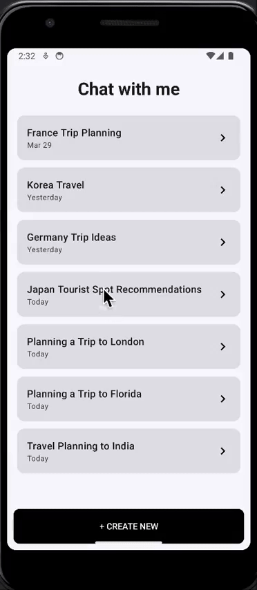

# ✈️ Travel guide chat

This app allows users to chat with an LLM-powered travel assistant to begin planning their journeys. It supports session history, intelligent title generation, and a polished Jetpack Compose UI.

---

## ✅ User Stories

### REQUIRED

- ✅ Start a new chat session  
- ✅ Send and receive messages from OpenAI’s GPT API or similar (via [OpenRouter](https://openrouter.ai))  
- ✅ View and re-engage with past chat sessions  

### BONUS

- ✅ Dynamically change the session title after the user starts chatting  
- ✅ Rename chat titles by long-pressing on session cards  
- ✅ System prompt configures LLM to act as a travel assistant  
- ✅ Timestamps shown inside chat bubbles  
- ✅ Chat scrolls to most recent message  

---

## 🧠 Design Overview

- Built using **Jetpack Compose** for a clean, modern UI  
- Integrates **OpenRouter** API using **Ktor**  
- Chat sessions are cached **locally** via `ChatStorage` (as JSON files)  
- Markdown support for LLM responses (rendered to plain text)  
- Conversations start with a friendly **system prompt**  
- Includes **back button navigation**, timestamp formatting, and scroll-to-latest message behavior  

---

## ▶️ Instructions for Running the Project

1. Clone the repo** and open it in Android Studio:

```bash
git clone https://github.com/your-username/travel-guide-chat.git
```

2. Create an api.properties file in the root of your project:
   
```bash
API_KEY=your_openrouter_api_key_here
```
You can generate a free API key from https://openrouter.ai

3. Update build.gradle.kts (Module: app)

At the top:
```bash
import java.util.Properties

val apiProperties = Properties().apply {
    load(File(rootDir, "api.properties").inputStream())
}
```
Inside the android block:

```bash
buildFeatures {
    buildConfig = true
}

defaultConfig {
    ...
    buildConfigField("String", "API_KEY", "\"${apiProperties["API_KEY"]}\"")
}
```
Run the App on an emulator or physical device using the ▶️ button in Android Studio.

---

## 🎥 App Walkthrough



[View on Imgur](https://imgur.com/a/KwLTxfu)

---

##🔐 Note
This app requires a valid OpenRouter API key defined as API_KEY in api.properties. The key is not included in version control.
